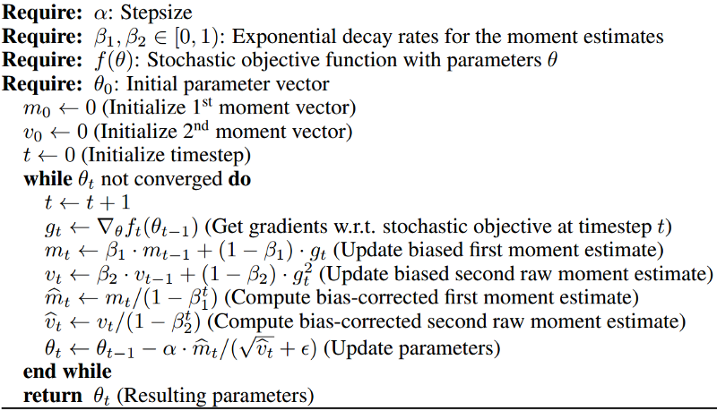

# Everything you need to know about Adam Optimizer

Copied from https://medium.com/@nishantnikhil/adam-optimizer-notes-ddac4fd7218

This is used to perform optimization and is one of the best optimizer at present. The author claims that it inherits from RMSProp and AdaGrad (Well it inherits from them).

**Features**:

- Parameters update are invariant to re-scaling of gradient — It means that if we have some objective function $f(x)$ and we change it to $k*f(x)$(where $k$ is some constant). There will be no effect on performance. We will come to it later.
- The step-size is **approximately** bounded by the step-size hyper-parameter. (Notice that something is in bold here!).
- It doesn’t require stationary objective. That means the $f(x)$ we talked about might change with time and still the algorithm will converge.
- Naturally performs step size annealing. Well remember the classical SGD, we used to decrease step size after some epochs, nothing as such is needed here.

**Parameters required** (The numbers in bracket are the optimal values):

- $\beta_1$ — This is used for decaying the running average of the gradient (0.001)
- $\beta_2$ — This is used for decaying the running average of the square of gradient (0.9)
- $\alpha$ — Step size parameter (0.001)
- $\varepsilon$ It is to prevent *Division from zero* error. ( $10^{-8}$)

**Algorithm:**

So here we are:

- Basically computing the gradient at line no. 6
- We are computing the running average of gradient (intuitively take it as mean) at line no.7
- We are computing the running average of gradient squared (intuitively take it as variance) at line no.8
  Here the author have been influenced by *RMSProp*. $β_2$ and $β_1$ can be thought as forgetting factor for respective moments.
- In line no. 9 and 10 we are correcting the bias for the two moments. But why? As we have initialized the moments with 0, that means they are biased towards 0. We might not use these two lines and will still converge theoretically, but the training will be very slow for the initial steps. Well let us take an example, suppose $β_1= 0.2$ and $g_1= 10.0$ From line 7 we have:
  $m_1 = 0.2 \times 0 + 0.8 \times 10 = 8$
  But the average should be 10 realistically, now from line no.9 update we have:
  new $m_1 = 8 / (0.8) = 10 $
  which is the desired value (well this is bias correction)
- Finally we update the parameters at line 11.
  Here the author has been influenced by AdaGrad (well it does not use running average and that is its weakness, but it was the first algorithm which proposed division of $step\_size \times gradient$ by root of squared gradients)
  The modification over RMSProp is that Adam also uses running average of gradient and it corrects biases. Even the optimal parameters for β2 and the step-size parameter are kept same. If β1 is set to 0, it is same as RMSProp with bias correction.

Division by $v_t$ helps in dealing with sparse gradient and I think use of $m_t$ instead of true gradient incorporates momentum. (Line no. 11)

One of the features of Adam is that it is scale invariant, if we scale the objective function by a scale of $k$, then at line 11 the mean changes to $k$ *previous_val and the denominator changes to $k$ *previous_val*, which in turn cancels out.

Step size is **approximately** bounded by step size parameter as the step size is multiplied and divided by the moments ($m_t/v_t$), but it will always be less than or equal to step_size. Well ($m_t/v_t$) becomes closer to zero as parameters approach optimal values and hence works as automatic annealing.