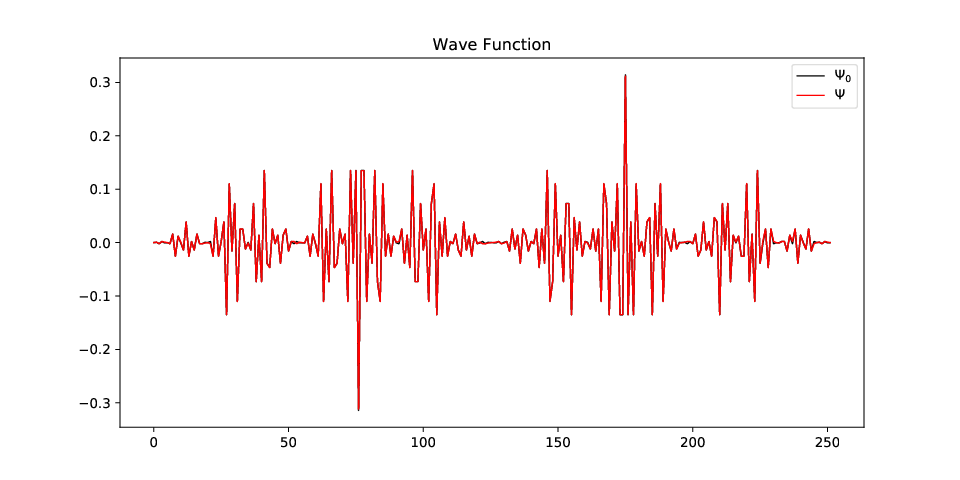
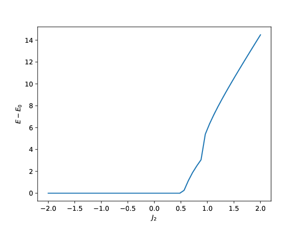
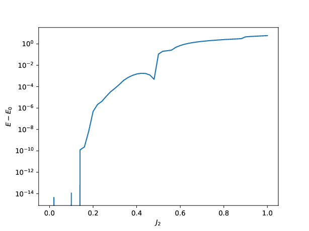
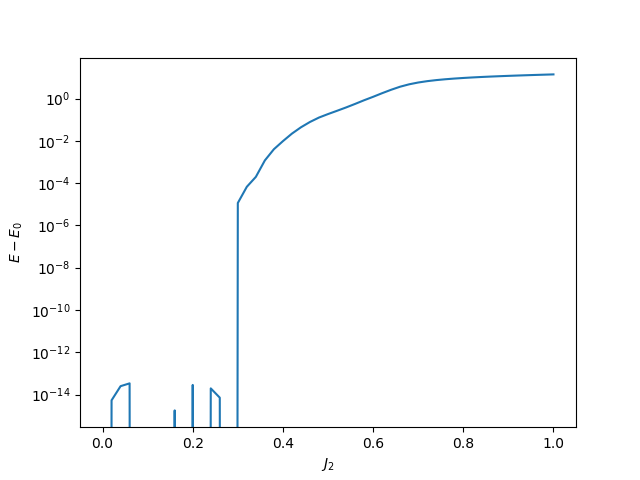
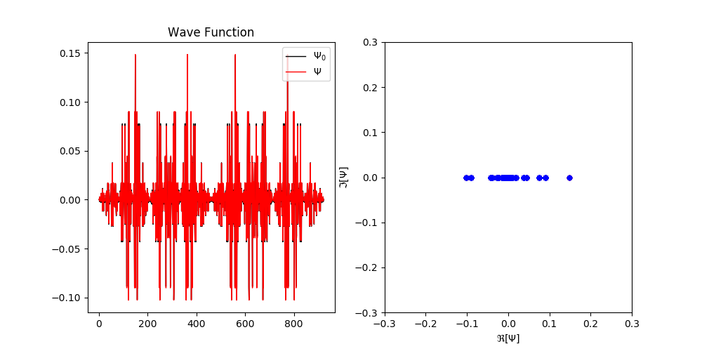
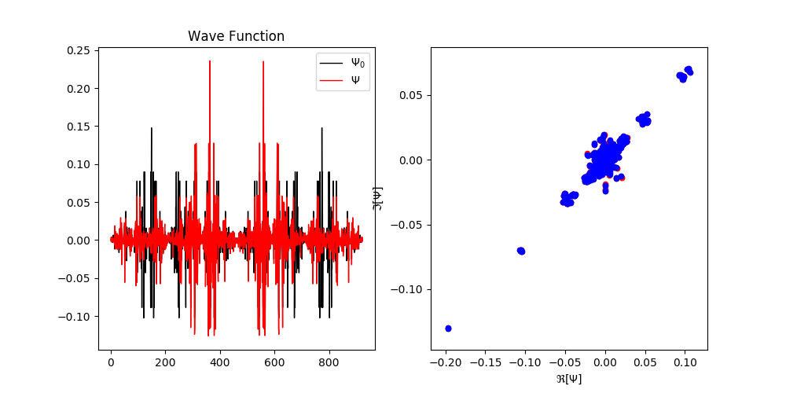

#Day 15 Aug

## Wave function

### parameters

* A: J2 = 0.2, N = 10

Lowest 10 energies = [-4.15096326 -3.76842215 -3.70954039 -3.39455178 -3.39455178 -3.06084076
 -3.06084076 -2.96478367 -2.96478367 -2.83993641]

* B: J2 = 0.5, N = 10

Lowest 10 energies = [-3.75       -3.75       -3.39978825 -3.27928965 -3.27928965 -3.13824484
 -3.13824484 -3.13464932 -2.98733684 -2.98733684]

Exists degeneracy, not a good example for bentchmarks.

* C: J2 = 0.2, N = 4

### results

    1. Comparing to correct sign, error in sign can be much larger than in energy. They have smaller sample size or cancel each other?
    2. Given correct signs, NN can be trained more efficiently. Can we prove the optimization is convex when the "Hamiltonian" matrix is negative.
    3. At J2 = 0.5, we can not compare signs due to degeneracy (~ 50% correct).
    4. Only ~ 250/30240 different configurations appear in 10-site samples.

### parameter A

Lowest 10 energies = [-4.15096326 -3.76842215 -3.70954039 -3.39455178 -3.39455178 -3.06084076
 -3.06084076 -2.96478367 -2.96478367 -2.83993641]

Running 0-th Iteration.
2000       Accept rate: 0.856
4000       Accept rate: 0.861
6000       Accept rate: 0.854
8000       Accept rate: 0.857
10000      Accept rate: 0.851
Before Training Sign, Energy = 2.97322923137
RESULT (252) = sa: -2.89471167857, relax: -2.73639249802
After training sign, Energy = -2.89471167857
Number of Configs Signed Incorrectly/All: 10/252 (3.9683%)
Error Ratio of Matrix Elements 1.2053%
Number of Samples Signed Incorrectly/All 147/10000 (1.4700%)
E/site = -0.289471167857 (-0.41509632551), Error = 17.8301%
diff rate = 0.0(norm=0.719404208193)

Running 1-th Iteration.
2000       Accept rate: 0.844
4000       Accept rate: 0.847
6000       Accept rate: 0.850
8000       Accept rate: 0.826
10000      Accept rate: 0.856
Before Training Sign, Energy = 2.95764451453
RESULT (252) = sa: -2.94907947751, relax: -2.79000973701
After training sign, Energy = -2.94907947751
Number of Configs Signed Incorrectly/All: 10/252 (3.9683%)
Error Ratio of Matrix Elements 1.0652%
Number of Samples Signed Incorrectly/All 128/10000 (1.2800%)
E/site = -0.294907947751 (-0.41509632551), Error = 16.9278%
diff rate = 0.0227777484859(norm=0.719404208193)

Running 2-th Iteration.
2000       Accept rate: 0.845
4000       Accept rate: 0.825
6000       Accept rate: 0.842
8000       Accept rate: 0.841
10000      Accept rate: 0.815
Before Training Sign, Energy = 2.96254019743
RESULT (252) = sa: -2.96155749439, relax: -2.77015161514
After training sign, Energy = -2.96155749439
Number of Configs Signed Incorrectly/All: 10/252 (3.9683%)
Error Ratio of Matrix Elements 1.0597%
Number of Samples Signed Incorrectly/All 129/10000 (1.2900%)
E/site = -0.296155749439 (-0.41509632551), Error = 16.7227%
diff rate = 0.0225978649609(norm=0.717653697288)

Running 3-th Iteration.
2000       Accept rate: 0.820
4000       Accept rate: 0.833
6000       Accept rate: 0.821
8000       Accept rate: 0.822
10000      Accept rate: 0.848
Before Training Sign, Energy = 2.95691943991
RESULT (252) = sa: -2.99696654149, relax: -2.74660515785
After training sign, Energy = -2.99696654149
Number of Configs Signed Incorrectly/All: 10/252 (3.9683%)
Error Ratio of Matrix Elements 0.9664%
Number of Samples Signed Incorrectly/All 118/10000 (1.1800%)
E/site = -0.299696654149 (-0.41509632551), Error = 16.1445%
diff rate = 0.022264571165(norm=0.716727473647)

... ...

Running 300-th Iteration.
2000       Accept rate: 0.281
4000       Accept rate: 0.282
6000       Accept rate: 0.281
8000       Accept rate: 0.310
10000      Accept rate: 0.271
Before Training Sign, Energy = 1.89933931239
RESULT (245) = sa: -4.15024465644, relax: -3.78778600693
After training sign, Energy = -4.15024465644
Number of Configs Signed Incorrectly/All: 29/245 (11.8367%)
Error Ratio of Matrix Elements 0.0117%
Number of Samples Signed Incorrectly/All 1524/10000 (15.2400%)
E/site = -0.415024465644 (-0.41509632551), Error = 0.0087%
diff rate = 0.000668497206872(norm=1.3827257929)

Running 301-th Iteration.
2000       Accept rate: 0.308
4000       Accept rate: 0.297
6000       Accept rate: 0.278
8000       Accept rate: 0.273
10000      Accept rate: 0.293
Before Training Sign, Energy = 1.96156032406
RESULT (243) = sa: -4.15009002005, relax: -3.86941695213
After training sign, Energy = -4.15009002005
Number of Configs Signed Incorrectly/All: 26/243 (10.6996%)
Error Ratio of Matrix Elements 0.0078%
Number of Samples Signed Incorrectly/All 1751/10000 (17.5100%)
E/site = -0.415009002005 (-0.41509632551), Error = 0.0105%
diff rate = 0.000833871120181(norm=1.382845482)

### wave function

$J_2= 0.2$, $|\langle \Psi|\Psi_0\rangle|^2 = 0.999771263796$



Day 15 Aug
==============================
## Taking subspace gradient to train is not a valid approach.

## VMC will work in the following two cases

1. $\{x\}$ sampled adequately, so that observables can be represented accuratly.
2. most elements in $\{x\}$ are unique, but observable are continuous with respect to neighborhood.

In case 2, signs differ a lot between different Monte Carlo sampling process, not consistantly changed.
Sign change

## New Ideas
1. multiple featured RBM + Linear, with some features negative definite.
2. contrastive divergence to generate samples.

Day 17 Aug
==============================
## $r-\theta$ neural network
Ansatz $\psi(\alpha,\beta,x) = r(\alpha,x)e^{i\theta(\beta,x)}, st. r,\theta,\alpha,\beta\in \mathcal{R}$.

### Variation

In the following we try to get $\frac{\partial E}{\partial \alpha}$ and $\frac{\partial E}{\partial \beta}$.

-----------------------

$$E(\alpha,\beta)=\frac{\int_{x,x'} H_{x,x'}r(\alpha,x)r(\alpha,x')e^{i(\theta(\beta,x')-\theta(\beta,x))}}{\int_x r(\alpha,x)^2}$$

$$\frac{\partial E}{\partial \alpha}=\frac{\int_{x,x'} H_{x,x'}(\theta) r(\alpha,x)\frac{\partial r(\alpha,x')}{\partial\alpha}+H_{x,x'}(\theta) r(\alpha,x')\frac{\partial r(\alpha,x)}{\partial\alpha}-E(\alpha,\beta)\int_{x}2r(\alpha,x)\frac{\partial r(\alpha,x)}{\partial \alpha}}{\int_xr(\alpha,x)^2}$$

with $H_{x,x'}=H_{xx'}e^{i(\theta(\beta,x')-\theta(\beta,x))}$.

Let $p(\alpha,x)\equiv \frac{r(\alpha,x)^2}{\int_xr(\alpha,x)^2}$,

$$\frac{\partial E}{\partial \alpha}=\int_{x}p(\alpha,x)\frac{\int_{x'}\left[H_{xx'}(\theta)+H_{x'x}(\theta)\right]r(\alpha,x')\partial r(\alpha,x)/\partial \alpha}{r(\alpha,x)^2}-2E(\alpha,\beta)\int_{x}p(\alpha,x)\frac{\partial r(\alpha,x)/\partial \alpha}{r(\alpha,x)}$$

$$\frac{\partial E}{\partial \alpha}\sim\langle\Re[E_{loc}]\Delta^{\alpha}_{loc}\rangle-E\langle\Delta^\alpha_{loc}\rangle$$

with $E_{loc}\equiv \int_{x'} H_{xx'}(\theta)\frac{r(\alpha,x')}{r(\alpha,x)}$ and $\Delta_{loc}^\alpha(x)\equiv\frac{\partial r(\alpha,x)/\partial \alpha}{r(\alpha,x)}$

------------------------------

$$\frac{\partial E}{\partial \beta}=\frac{\int_{x,x'} H_{x,x'}(\theta) r(\alpha,x)r(\alpha,x')i[\frac{\partial\theta(\beta,x')}{\partial \beta}-\frac{\partial\theta(\beta,x)}{\partial \beta}]}{\int_xr(\alpha,x)^2}$$

$$\frac{\partial E}{\partial \beta}=\int_{x,x'} \left[H_{x,x'}(\theta)-H_{x'x}(\theta)\right] p(\alpha,x)\frac{r(\alpha,x')}{r(\alpha,x)}(-i)\frac{\partial\theta(\beta,x)}{\partial \beta}$$

$$\frac{\partial E}{\partial \beta}\sim\langle\Im[E_{loc}]\Delta^{\beta}_{loc}\rangle$$

with $\Delta^\beta_{loc}\equiv \partial\theta(\beta,x)/\partial\beta$

Apparently, gradients are all real.

Day 20 Aug
===========================
## Do translational invariance allow a change of sign?

Yes, for example, 6 site version Marshall Sign Rule (MSR), we can have 3 up spins in the ground state, 
e.g. 1, 2 up spins in A, B sublattices respectively.
When we shift the spin configuration for 1-site, the sign changes according to MSR.

## r-theta version Stochastic Reconfiguration
In traditional SR, we have
$$S(\alpha,\alpha')\equiv\langle\Delta^{\alpha\dagger}_{loc}\Delta^{\alpha'}_{loc}\rangle-\langle\Delta_{loc}^{\alpha\dagger}\rangle\langle\Delta_{loc}^{\alpha'}\rangle$$

$F(\alpha)\equiv\langle\Delta_{loc}^{\alpha\dagger} E_{loc}\rangle-\langle\Delta_{loc}^{\alpha\dagger}\rangle\langle E_{loc}\rangle$

and the gradient

$$G=S^{-1}F$$

------------------------------------

In out case,

$$\Delta_{loc}^\alpha=\frac{\partial\psi(\alpha,\beta,x)/\partial\alpha}{\psi(\alpha,\beta,x)}=\frac{\partial r(\alpha,x)/\partial\alpha} {r(\alpha,x)}$$

$$\Delta_{loc}^\beta=\frac{\partial\psi(\alpha,\beta,x)}{\partial\beta}=i\frac{\partial \theta(\beta,x)}{\partial\beta}$$

will $G$ be real again in this imaginary time evolution?

Day 23 Aug
======================

Violation of Marshall Sign Rule
---------------------------



$J_1,J_2$ model, 12 sites.

Here, $E_0$ is evaluated using exact ground state wave function $v_0$.

$E$ is evaluated using ${\rm MSR}(|v|)$. Here, $\rm MSR$ is Marshall Sign Rule function.

To make it clear,



we see when $J_2\leq0.4$, MSR is only slightly violated.

To run this example, 
```
    from controllers import scale_ed_msr
    scale_ed_msr(J2MIN=0, J2MAX=1, NJ2=51, size=(12,), yscale='log')
```

For $2D$  $4\times4$ model, we have the similar behavior



## Training large $J_2$
For large $J_2$, MSR is strongly violated, as a result, neural networks are extremely hard to train. For example $J_2=0.8$.
* given sign, 1-layer RBM, after 300 steps of SR($\delta=10^{-4}$ regulation) training,  $\|\langle\Psi_0|\Psi\rangle\|_2\simeq0.999$, Error in energy is about $0.05\%$.

  

* not given sign, complex 1 Conv-Layer + 2 Linear-Layer (with 16, 8 features), $\|\langle\Psi_0|\Psi\rangle\|_2\simeq0.57$, Error in energy is about $2.5\%$.

  
