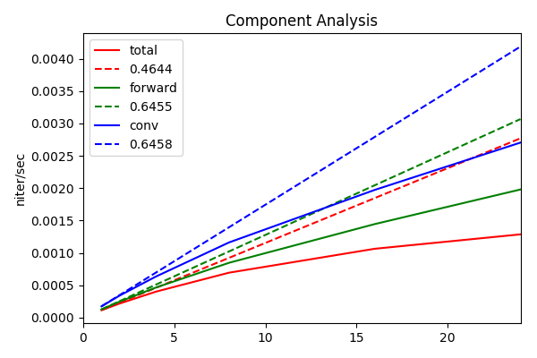
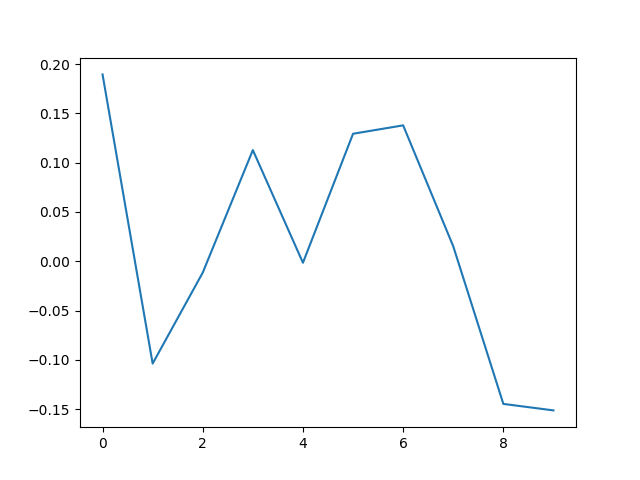

Day 15 Aug

## Wave function

### parameters

* A: J2 = 0.2, N = 10

Lowest 10 energies = [-4.15096326 -3.76842215 -3.70954039 -3.39455178 -3.39455178 -3.06084076
 -3.06084076 -2.96478367 -2.96478367 -2.83993641]

* B: J2 = 0.5, N = 10

Lowest 10 energies = [-3.75       -3.75       -3.39978825 -3.27928965 -3.27928965 -3.13824484
 -3.13824484 -3.13464932 -2.98733684 -2.98733684]

Exists degeneracy, not a good example for benchmarks.

* C: J2 = 0.2, N = 4

### results

    1. Comparing to correct sign, error in sign can be much larger than in energy. They have smaller sample size or cancel each other?
    2. Given correct signs, NN can be trained more efficiently. Can we prove the optimization is convex when the "Hamiltonian" matrix is negative.
    3. At J2 = 0.5, we can not compare signs due to degeneracy (~ 50% correct).
    4. Only ~ 250/30240 different configurations appear in 10-site samples.

### parameter A

Lowest 10 energies = [-4.15096326 -3.76842215 -3.70954039 -3.39455178 -3.39455178 -3.06084076
 -3.06084076 -2.96478367 -2.96478367 -2.83993641]

Running 0-th Iteration.
2000       Accept rate: 0.856
4000       Accept rate: 0.861
6000       Accept rate: 0.854
8000       Accept rate: 0.857
10000      Accept rate: 0.851
Before Training Sign, Energy = 2.97322923137
RESULT (252) = sa: -2.89471167857, relax: -2.73639249802
After training sign, Energy = -2.89471167857
Number of Configs Signed Incorrectly/All: 10/252 (3.9683%)
Error Ratio of Matrix Elements 1.2053%
Number of Samples Signed Incorrectly/All 147/10000 (1.4700%)
E/site = -0.289471167857 (-0.41509632551), Error = 17.8301%
diff rate = 0.0(norm=0.719404208193)

Running 1-th Iteration.
2000       Accept rate: 0.844
4000       Accept rate: 0.847
6000       Accept rate: 0.850
8000       Accept rate: 0.826
10000      Accept rate: 0.856
Before Training Sign, Energy = 2.95764451453
RESULT (252) = sa: -2.94907947751, relax: -2.79000973701
After training sign, Energy = -2.94907947751
Number of Configs Signed Incorrectly/All: 10/252 (3.9683%)
Error Ratio of Matrix Elements 1.0652%
Number of Samples Signed Incorrectly/All 128/10000 (1.2800%)
E/site = -0.294907947751 (-0.41509632551), Error = 16.9278%
diff rate = 0.0227777484859(norm=0.719404208193)

Running 2-th Iteration.
2000       Accept rate: 0.845
4000       Accept rate: 0.825
6000       Accept rate: 0.842
8000       Accept rate: 0.841
10000      Accept rate: 0.815
Before Training Sign, Energy = 2.96254019743
RESULT (252) = sa: -2.96155749439, relax: -2.77015161514
After training sign, Energy = -2.96155749439
Number of Configs Signed Incorrectly/All: 10/252 (3.9683%)
Error Ratio of Matrix Elements 1.0597%
Number of Samples Signed Incorrectly/All 129/10000 (1.2900%)
E/site = -0.296155749439 (-0.41509632551), Error = 16.7227%
diff rate = 0.0225978649609(norm=0.717653697288)

Running 3-th Iteration.
2000       Accept rate: 0.820
4000       Accept rate: 0.833
6000       Accept rate: 0.821
8000       Accept rate: 0.822
10000      Accept rate: 0.848
Before Training Sign, Energy = 2.95691943991
RESULT (252) = sa: -2.99696654149, relax: -2.74660515785
After training sign, Energy = -2.99696654149
Number of Configs Signed Incorrectly/All: 10/252 (3.9683%)
Error Ratio of Matrix Elements 0.9664%
Number of Samples Signed Incorrectly/All 118/10000 (1.1800%)
E/site = -0.299696654149 (-0.41509632551), Error = 16.1445%
diff rate = 0.022264571165(norm=0.716727473647)

... ...

Running 300-th Iteration.
2000       Accept rate: 0.281
4000       Accept rate: 0.282
6000       Accept rate: 0.281
8000       Accept rate: 0.310
10000      Accept rate: 0.271
Before Training Sign, Energy = 1.89933931239
RESULT (245) = sa: -4.15024465644, relax: -3.78778600693
After training sign, Energy = -4.15024465644
Number of Configs Signed Incorrectly/All: 29/245 (11.8367%)
Error Ratio of Matrix Elements 0.0117%
Number of Samples Signed Incorrectly/All 1524/10000 (15.2400%)
E/site = -0.415024465644 (-0.41509632551), Error = 0.0087%
diff rate = 0.000668497206872(norm=1.3827257929)

Running 301-th Iteration.
2000       Accept rate: 0.308
4000       Accept rate: 0.297
6000       Accept rate: 0.278
8000       Accept rate: 0.273
10000      Accept rate: 0.293
Before Training Sign, Energy = 1.96156032406
RESULT (243) = sa: -4.15009002005, relax: -3.86941695213
After training sign, Energy = -4.15009002005
Number of Configs Signed Incorrectly/All: 26/243 (10.6996%)
Error Ratio of Matrix Elements 0.0078%
Number of Samples Signed Incorrectly/All 1751/10000 (17.5100%)
E/site = -0.415009002005 (-0.41509632551), Error = 0.0105%
diff rate = 0.000833871120181(norm=1.382845482)

### wave function

$J_2= 0.2$, $|\langle \Psi|\Psi_0\rangle|^2 = 0.999771263796$


Day 15 Aug
==============================
## Taking subspace gradient to train is not a valid approach.

## VMC will work in the following two cases

1. $\{x\}$ sampled adequately, so that observables can be represented accuratly.
2. most elements in $\{x\}$ are unique, but observable are continuous with respect to neighborhood.

In case 2, signs differ a lot between different Monte Carlo sampling process, not consistantly changed.
Sign change

## New Ideas
1. multiple featured RBM + Linear, with some features negative definite.
2. contrastive divergence to generate samples.

Day 17 Aug
==============================
## $r-\theta$ neural network
Ansatz $\psi(\alpha,\beta,x) = r(\alpha,x)e^{i\theta(\beta,x)}, st. r,\theta,\alpha,\beta\in \mathcal{R}$.

### Variation

In the following we try to get $\frac{\partial E}{\partial \alpha}$ and $\frac{\partial E}{\partial \beta}$.

-----------------------

$$E(\alpha,\beta)=\frac{\int_{x,x'} H_{x,x'}r(\alpha,x)r(\alpha,x')e^{i(\theta(\beta,x')-\theta(\beta,x))}}{\int_x r(\alpha,x)^2}$$

$$\frac{\partial E}{\partial \alpha}=\frac{\int_{x,x'} H_{x,x'}(\theta) r(\alpha,x)\frac{\partial r(\alpha,x')}{\partial\alpha}+H_{x,x'}(\theta) r(\alpha,x')\frac{\partial r(\alpha,x)}{\partial\alpha}-E(\alpha,\beta)\int_{x}2r(\alpha,x)\frac{\partial r(\alpha,x)}{\partial \alpha}}{\int_xr(\alpha,x)^2}$$

with $H_{x,x'}=H_{xx'}e^{i(\theta(\beta,x')-\theta(\beta,x))}$.

Let $p(\alpha,x)\equiv \frac{r(\alpha,x)^2}{\int_xr(\alpha,x)^2}$,

$$\frac{\partial E}{\partial \alpha}=\int_{x}p(\alpha,x)\frac{\int_{x'}\left[H_{xx'}(\theta)+H_{x'x}(\theta)\right]r(\alpha,x')\partial r(\alpha,x)/\partial \alpha}{r(\alpha,x)^2}-2E(\alpha,\beta)\int_{x}p(\alpha,x)\frac{\partial r(\alpha,x)/\partial \alpha}{r(\alpha,x)}$$

$$\frac{\partial E}{\partial \alpha}\sim\langle\Re[E_{loc}]\Delta^{\alpha}_{loc}\rangle-E\langle\Delta^\alpha_{loc}\rangle$$

with $E_{loc}\equiv \int_{x'} H_{xx'}(\theta)\frac{r(\alpha,x')}{r(\alpha,x)}$ and $\Delta_{loc}^\alpha(x)\equiv\frac{\partial r(\alpha,x)/\partial \alpha}{r(\alpha,x)}$

------------------------------

$$\frac{\partial E}{\partial \beta}=\frac{\int_{x,x'} H_{x,x'}(\theta) r(\alpha,x)r(\alpha,x')i[\frac{\partial\theta(\beta,x')}{\partial \beta}-\frac{\partial\theta(\beta,x)}{\partial \beta}]}{\int_xr(\alpha,x)^2}$$

$$\frac{\partial E}{\partial \beta}=\int_{x,x'} \left[H_{x,x'}(\theta)-H_{x'x}(\theta)\right] p(\alpha,x)\frac{r(\alpha,x')}{r(\alpha,x)}(-i)\frac{\partial\theta(\beta,x)}{\partial \beta}$$

$$\frac{\partial E}{\partial \beta}\sim\langle\Im[E_{loc}]\Delta^{\beta}_{loc}\rangle$$

with $\Delta^\beta_{loc}\equiv \partial\theta(\beta,x)/\partial\beta$

Apparently, gradients are all real.

Day 20 Aug
===========================
## Do translational invariance allow a change of sign?

Yes, for example, 6 site version Marshall Sign Rule (MSR), we can have 3 up spins in the ground state, 
e.g. 1, 2 up spins in A, B sub-lattices respectively.
When we shift the spin configuration for 1-site, the sign changes according to MSR.

However, for real Hamiltonian, $T_1|\Psi\rangle=\pm|\Psi\rangle$. In Heisenberg model, $-1$ corresponds to $2\times odd$ number of spins.

## r-theta version Stochastic Reconfiguration
To get the imaginary time evolution of parameters, we start from the Lagrangian

$$L=\left[\frac{i}{2}(\langle\dot{\psi(\alpha)}|\psi(\alpha)\rangle-\langle\psi(\alpha)|\dot{\psi(\alpha)}\rangle)-\langle\psi(\alpha)|H|\psi(\alpha)\rangle\right]/\langle\psi(\alpha)|\psi(\alpha)\rangle$$

Here, $\alpha$ is a set of real parameters.

To achieve minimum action, we apply Euler-Lagrangian formula $\frac{\partial L}{\partial \alpha}-\frac{d}{dt}(\frac{\partial L}{\partial \dot{\alpha}})=0$.

$$\begin{align}\frac{\partial L}{\partial\alpha_i}=&\left[\frac{i}{2}(\langle\psi(\alpha)|\frac{\partial}{\partial\alpha_i}^\dagger\sum_j\dot{\alpha_j}\frac{\partial}{\partial\alpha_j}^\dagger+\sum_j\dot{\alpha_j}\frac{\partial}{\partial\alpha_j}^\dagger\frac{\partial}{\partial\alpha_i}|\psi(\alpha)\rangle-\langle\psi(\alpha)|\frac{\partial}{\alpha_i}^\dagger\sum_j\dot{a_j}\frac{\partial}{\partial a_j}+\sum_j\dot{a_j}\frac{\partial}{\partial a_j}\frac{\partial}{\partial\alpha_i}|\psi(\alpha)\rangle)\\-\langle\psi(\alpha)|\frac{\partial}{\partial \alpha_i}^\dagger H+H\frac{\partial}{\partial \alpha_i}|\psi(\alpha)\rangle\right]/N\\&-\left[\frac{i}{2}(\langle\psi(\alpha)|\sum_j\dot{\alpha_j}\frac{\partial}{\partial\alpha_j}^\dagger|\psi(\alpha)\rangle-\langle\psi(\alpha)|\sum_j\dot{\alpha_j}\frac{\partial}{\partial\alpha_j}|\psi(\alpha)\rangle)-\langle\psi(\alpha)|H|\psi(\alpha)\rangle\right]\langle\psi(\alpha)|\frac{\partial}{\partial \alpha_i}+\frac{\partial}{\partial \alpha_i}^\dagger|\psi(\alpha)\rangle/N^2\end{align}$$

Here, $N=\langle\psi(\alpha)|\psi(\alpha)\rangle$.

Notice $\partial_i,\partial_j$ (shorthand for $\frac{\partial}{\partial \alpha_{i,j}}$) are diagonal in $x$ basis ( ? ), they commute with each other.

$$\begin{align}\frac{\partial L}{\partial \alpha_i}=&\langle(\partial_i+\partial_i^\dagger)\left[-\frac{i}{2}\sum_j\dot{\alpha_j}(\partial_j-\partial_j^\dagger)\right]\rangle-\langle\partial_i^\dagger H+H\partial_i\rangle+\left[\frac{i}{2}\langle\sum_j\dot{\alpha_j}(\partial_j-\partial_j^\dagger)\rangle+\langle H\rangle\right]\langle\partial_i+\partial_i^\dagger\rangle\\=&2\langle\Re(\partial_i)\sum_j\dot{\alpha_j}\Im(\partial_j)\rangle-2\sum_j\dot{\alpha_j}\langle\Im(\partial_j)\rangle\langle\Re(\partial_i)\rangle-2\Re(\langle\partial_i^\dagger H\rangle-\langle\partial^\dagger\rangle\langle H\rangle )\end{align}$$

On the other side,

$$\begin{align}\frac{d}{dt}(\frac{\partial L}{\partial \dot{\alpha_i}})=&-\frac{i}{2}\left[\langle\psi(\alpha)|\sum_j\dot{\alpha_j}\partial_j^\dagger(\partial_i-\partial_i^\dagger)+(\partial_i-\partial_i^\dagger)\sum_j\dot{\alpha_j}\partial_j|\psi(\alpha)\rangle\right]/N\\&-\langle\psi(\alpha)|-\frac{i}{2}(\partial_i-\partial_i^\dagger)|\psi(\alpha)\rangle\langle\psi(\alpha)|\sum_j\dot{\alpha_j}(\partial_j+\partial_j^\dagger)|\psi(\alpha)\rangle/N^2\\=&2\sum_j\dot{\alpha_j}\langle\Re(\partial_j)\Im(\partial_i)\rangle-2\sum_j\dot{\alpha_j}\langle\Re(\partial_j)\rangle\langle\Im(\partial_i)\rangle\end{align}$$

To make it clear, we define matrix $S_{i,j}=\Im(\langle:\partial_i^\dagger\partial_j:\rangle$ and vectors $F_i=\Re(\langle:\partial_i^\dagger H:\rangle)$,  $g_i=\dot{\alpha_i}$. When we take the extreme, we will have

$$S\cdot g-F=0$$

obviously $g=S^{-1}F$ is real during real time evolution.

What about imaginary time evolution?

We have our new Lagrangian

$$L=\left[\frac{1}{2}(\langle\psi(\alpha)|\frac{d}{d\tau}^\dagger+\frac{d}{d\tau}|\psi(\alpha)\rangle-\langle\psi(\alpha)|H|\psi(\alpha)\rangle\right]/\langle\psi(\alpha)|\psi(\alpha)\rangle$$

Then derivatives canceled ??????????????????????????????????????????

## Naive version

$$S(\alpha,\alpha')\equiv\langle\Delta^{\alpha\dagger}_{loc}\Delta^{\alpha'}_{loc}\rangle-\langle\Delta_{loc}^{\alpha\dagger}\rangle\langle\Delta_{loc}^{\alpha'}\rangle$$

$F(\alpha)\equiv\langle\Delta_{loc}^{\alpha\dagger} E_{loc}\rangle-\langle\Delta_{loc}^{\alpha\dagger}\rangle\langle E_{loc}\rangle$

and the gradient

$$G=S^{-1}F$$

------------------------------------

In out case,

$$\Delta_{loc}^\alpha=\frac{\partial\psi(\alpha,\beta,x)/\partial\alpha}{\psi(\alpha,\beta,x)}=\frac{\partial r(\alpha,x)/\partial\alpha} {r(\alpha,x)}$$

$$\Delta_{loc}^\beta=\frac{\partial\psi(\alpha,\beta,x)}{\partial\beta}=i\frac{\partial \theta(\beta,x)}{\partial\beta}$$

* must $G$ be complex in this imaginary time evolution?
* $S$ is block diagonal?

$S$ is block diagonal means $S(\alpha,\beta)\equiv\langle\Delta^{\alpha\dagger}_{loc}\Delta^{\beta}_{loc}\rangle-\langle\Delta_{loc}^{\alpha\dagger}\rangle\langle\Delta_{loc}^{\beta}\rangle=0$

or it will be block diagonal layer wise? as Roger Luo commented.

Day 23 Aug
======================

Violation of Marshall Sign Rule
---------------------------


$J_1,J_2$ model, 12 sites.

Here, $E_0$ is evaluated using exact ground state wave function $v_0$.

$E$ is evaluated using ${\rm MSR}(|v|)$. Here, $\rm MSR$ is Marshall Sign Rule function.

To make it clear,


we see when $J_2\leq0.4$, MSR is only slightly violated.

To run this example, 
```
    from controllers import scale_ed_msr
    scale_ed_msr(J2MIN=0, J2MAX=1, NJ2=51, size=(12,), yscale='log')
```

For $2D$  $4\times4$ model, we have the similar behavior


## Training large $J_2$
For large $J_2$, MSR is strongly violated, as a result, neural networks are extremely hard to train. For example $J_2=0.8$.
* given sign, 1-layer RBM, after 300 steps of SR($\delta=10^{-4}$ regulation) training,  $\|\langle\Psi_0|\Psi\rangle\|_2\simeq0.999$, Error in energy is about $0.05\%$.

  

* not given sign, complex 1 Conv-Layer + 2 Linear-Layer (with 16, 8 features), $\|\langle\Psi_0|\Psi\rangle\|_2\simeq0.57$, Error in energy is about $2.5\%$.

  

  ## Given Amplitude to train sign

  $J_2=0.8, N=10, E_G=-0.433768079327$.

  For vectors, 

For 1-layer/2-layer network, $E=-0.145755657726, overlap = 0.09$, they do not converge!


without TI, even worse.

How can gradient descent work in sign networks?


# Day 29 Aug

Representation power of a linear $\theta$-network.

$L=4, J_2=0.8,S_z=0$

Bases of Hilbert space are $\sigma_{1-6}\in\{|++--\rangle,|+-+-\rangle,|+--+\rangle,|-++-\rangle,|-+-+\rangle,|--++\rangle\}$.

Here, $+$ represents spin $\uparrow$ or $+1$.

The sign structure of ground state is $\{-,0,+,+,0,-\}$, our task is to construct a network of function $\theta$ that $\theta(\sigma_{1,3,4,6})\%2\pi=\pi,0,0,\pi$, like XOR gates.

## Why our network fails

Our $\theta$ Network

$$x\rightarrow {\rm Conv(stride=2, num\_feature=4)}$$

​	$$\color{red}\rightarrow{\rm Sum~over~convolution~ axes}$$

​	$$\rightarrow{\rm Linear(4\times1)\rightarrow {\rm output~ as~} \theta}$$

Summation after convolution is what matters! Because $W\sigma_i =-W\sigma_{i+2}$, outputs will cancel each other if added directly!

Instead of putting a non-linear function layer after convolution, or training XOR gates, can we use product of neighbor bits as inputs? like $x_1x_2, x_2x_3,\ldots,x_{n-1}x_n,x_nx_1$. Which is supposed easier to train in large $J_2$ limit.


# Day 1 Sep

Our New Network that works extremely fine in$N=8,12, J_2=0.8$ network.


Our new network that works for $4\times4, J_2=0.8$ networks.


Result, Energy as a function of steps, with $x$ axis in log scale.


The dashed line is the exact energy. Zoom in, we see it is still going down


# Day 5 Sep
Bentchmark on filter size $K$ and network depth $D$.
Model parameter $J_2=0.5, size = (4, 4)$, exact energy is -8.45792335.

## Bentchmark for different kernel size

### structures
For $K=1,2,3,4$ (filter size $(K\times K)$), using number of features [8, 32]

|                   K=1                    |                   K=2                    |                   K=3                    |                   K=4                    |
| :--------------------------------------: | :--------------------------------------: | :--------------------------------------: | :--------------------------------------: |
|  |  |  |  |

### Error as a function of step


## Bentchmark for different network depth

### structures
For $K=4$ (filter size $(K\times K)$), using number of features as shown in the following tables

|                  8, 32                   |               16, 128, 32                |             16, 128, 64, 32              |           16, 128, 64, 32, 16            |            32, 256, 64, 16, 8            |
| :--------------------------------------: | :--------------------------------------: | :--------------------------------------: | :--------------------------------------: | :--------------------------------------: |
|  |  |  |  |  |
Table: Configuration 1-5


|              1, 16, 256, 16              |            32, 64, 512, 64, 8            |              4, 16, 256, 16              |
| :--------------------------------------: | :--------------------------------------: | :--------------------------------------: |
|  |  |  |
Table: Configuration 6-8

### Error as a function of step


# Day 7 Sep

10000 step benchmark, lines are averaged over 20 steps (otherwise too noisy).

### Networks


Fig: In above legends r for real product layer, c for complex. 2, 7, 8 are target networks.

### Observations

* complex product layers are stabler than real ones.
* network - 7 (32, 64, 512, 64, 8), performance of deep and wide network is similar to shallow network - 2 (16, 128, 32), all with error $<0.1\%$, but converge slower.
* number of features in product network is important.

# Day 11 Sep
## MPI Acceleration Test
Number of flops on TianHe and Delta servers as a function of number of cores.
|           TianHe           |         Delta101          |          Delta102          |
| :------------------------: | :-----------------------: | :------------------------: |
|  |  |  |
The forward method of convolusion layer take >50% resources, good news.

Resources spent on Parrallel/ Sequencial/ Transimission (Tian He as an example)


Resources spent on Parrallel/ Sequencial/ Transimission (Tian He as an example)
Error in 100 step didn't blow up.


# Day 19 Sep
Benchmark on different product input,

* 0: raw data,
* 1: product of 1st NN,
* 2: product of 2nd NN,
* 3: product of consequtive 3 sites,
* 4: 0 + 1
* 5: 0 + 1 + 2
* 6: 0 + 1 + 2 +3

## 8 sites, different $J_2$
### $J_2=0.0$


### $J_2=0.5$


### $J_2=0.8$


## $12$ sites, $J_2=0.8$


Curve for energy


# Day 21 Sep
Ground state symmetry analysis, these ground states are obtained using ED. 

columns are different sizes for chain varying from $2$ to $20$, and rows are different $J_2$ varying from $0.0$ to $1.0$.

Data element '-++'  means system changes sign for translate 1 site operation ($T_1$), keeps sign for spin flip ($F$) and space inversion symmetry $I$.


## Summary

* $I,F$ changes sign of wave function when and only when $L/2$ is odd.
* For $J_2<0.5$, $T_1, F, I$ are all positive for even $L/2$ and negative for odd $L/2$.
* For $L=16$, $T_1$ have negative eigenvalue! This must be why I fail to get ground state for $N=16$. Is there a phase transition? I suspect even representation power of our Ansaz is enough to describe signn structures of $J_2=0.5$ and $J_2=0.0$, it can fail to describe sign structures for $J_2>0.5$.

# Day 23 Sep

## 16 Sites, $J_2=0.8$

## Network


### Description

* Poly layer has kernels attribute, which represents different types of polynomial expansions.
* Filter filter out Fourier amplitude with specific momentum, equal to `Mean` when $momentum=0$.

## Error vs different polynomial expansions


## Error vs number of feature.


## Target State with $k=\pi$


## Weights of polynomials (Real Part)



* from wave function overlap, we see performance of pure polynomial is worst (however, using Rmsprop instead of Adam, we have ~0.996 overlap for pure polynomial expansion).

*  positive-negative oscillating structure is shown in all these cases. 

* The real part of these functions for $x\in[-2,2]$ are very different

  

# kData flow


This is an example, I show that after polynomial operation, we have data amplitude blowing up.


## 20 Sites, $J_2=0.8$


$20$ features in convolution layer, polynomial kernel, optimize using Adam (0.01). 

# Day 25 Sep
Complex activation function,
* Sigmoid is singular at $z=(2n+1)i\pi$, its adaption is $f(x)=\frac{1}{1+e^{-\Re z}}+\frac{1}{1+e^{-\Im z}}$ (Birx 1992, Benvenuto 1992).
* Tanh is singular at $z=(n+1/2)i\pi$, its adaption for CVNN is $f(z) = \tanh(\Re z)+i\tanh(\Im z)$ (Kechriotis 1994, Kinouchi 1995), $f(z)=\tanh(|z|)\exp(i\arg(z))$ (Hirose 1994).
* $f(x) = \frac{z}{|z|}$
* $f(x) = \frac{z}{c+\frac{1}{r}|z|}$ (Noest 1998)
* $f(x) = \frac{|z|}{c+\frac{1}{r}|z|}\exp\left[i\{\arg z-\frac{1}{2^n}\sin(2^n \arg z)\}\right]$ (Kuroe 2005).

Comparison can be found in Kuroe 2009.

* using conformal mapping $f(z) = \frac{(\cos\theta+i\sin\theta)(z-\alpha)}{1-\bar{\alpha}z},|\alpha|<1$,
  This function is the general conformal mapping that transform unit disk in the complex plane onto itself and also a M¨obius transformation.
  First used by Mandic 2000 in RVNN.

# Day 27 Sep

Using real networks, 16 site $J_2=0.8$ will converge to an error $\simeq 1.5\%$. it's Complex counterpart is $\simeq0.1\%$.

Bethe Ansatz for Heisenberg model, $|\Psi\rangle=\sum\limits_{1\leq n_1\leq \ldots\leq n_r\leq N}f(n_1,\ldots,n_r)|n_1,\ldots,n_r\rangle$, with $C_N^r$ terms.

$$f(n_1,\ldots,n_2)=\sum_{\mathcal{P}\in S_r}\exp(i\sum\limits_{i=1}^r k_{\mathcal{P}_j}n_j+\frac{i}{2}\sum_{l<j}\theta_{\mathcal{P_l\mathcal{P}_j}})$$

here, $r$ is the number of particles (magnon with spin $\downarrow$), $n_i$ is the position of $i$-th particle, $k_i$ is the quasi-momenta of $i$-th particle. $\mathcal{P}\in S_r$ is over all $r!$ permutations of labels ${1,2,\ldots,r}$. $\theta_{jl}=-\theta_{lj}$ is the scattering phase for each $(k_l,k_j)$ pair. By applying eigenstate condition, we have

$$e^{i\theta_{jl}}=-\frac{e^{i(k_j+k_l)}+1-2e^{ik_j}}{e^{i(k_j+k_l)}+1-2e^{ik_l}}$$

which can be casted in real form as $$2\cot \frac{\theta_{jl}}{2}=\cot\frac{k_j}{2}-\cot\frac{k_l}{2}$$

# Day 3 Oct
## Back Propagation for Complex Variables
The gradient for **real** cost function $J(z)$ defined on complex plane $z=x+iy$ is
$$\begin{align}\nabla J(z) &= \frac{\partial J}{\partial x} + i\frac{\partial J}{\partial y}\\&= \frac{\partial J}{\partial z}\frac{\partial z}{\partial x}+\frac{\partial J}{\partial z^*}\frac{\partial z^*}{\partial x}+ i\left[\frac{\partial J}{\partial z}\frac{\partial z}{\partial y}+\frac{\partial J}{\partial z^*}\frac{\partial z^*}{\partial y}\right]\\&=2\frac{\partial J}{\partial z^*}=2\left(\frac{\partial J}{\partial z}\right)^*\end{align}$$

In the last line, we have used the reality of $J$. In the following complex version of BP will be derived in order to get $\frac{\partial J}{\partial z}$ layer by layer

$$\frac{\partial J}{\partial y_l}=\sum\limits_{y_{l+1}}\frac{\partial J}{\partial y_{l+1}}\frac{\partial y_{l+1}}{\partial y_l}+\frac{\partial J}{\partial y^*_{l+1}}\frac{\partial y_{l+1}^*}{\partial y_l}. $$

Here, $y_l$ and $y_{l+1}$ are variables (including input nodes and network variables) in the $l$-th layer and $l+1$-th layer respectively, and $y_{l+1}=f_l(y_l)$.

* If $f_l$ is **holomophic**, we have contributions from the second term vanish, thus

  $$\frac{\partial J}{\partial y_l}=\sum\limits_{y_{l+1}}\frac{\partial J}{\partial y_{l+1}}\frac{\partial y_{l+1}}{\partial y_l},$$

  which is the exactly the same BP formula as for real functions except here we take its conjugate.

* If $f_l$ is **non-holomophic**, we have

  $$\frac{\partial J}{\partial y_l}=\sum\limits_{y_{l+1}}\frac{\partial J}{\partial y_{l+1}}\frac{\partial y_{l+1}}{\partial y_l}+\left(\frac{\partial J}{\partial y_{l+1}}\frac{\partial y_{l+1}}{\partial y_l^*}\right)^*. $$

### Numerical test

Given input vector $x$ of length $10$, our toy network gives output $J=f_2(f_1(f_1(x)))$ as the cost function, with $f_1(z)=z^*$ and $f_2(z)=-e^{-|z|^2}$.

```python
import numpy as np
from matplotlib.pyplot import *

f1_forward = lambda x:x.conj()
df1_z = lambda x,y: np.zeros_like(x,dtype='complex128')
df1_zc = lambda x,y: np.ones_like(x,dtype='complex128')

f2_forward = lambda x:-np.exp(-x*x.conj())
df2_z = lambda x,y: -y*x.conj()
df2_zc = lambda x,y: -y*x

def roger_backward(df_z,df_zc):
    return lambda x,y,dy:df_z(x,y).conj()*dy

def akira_backward(df_z,df_zc):
    return lambda x,y,dy:df_z(x,y)*dy+df_zc(x,y).conj()*dy.conj()

# the version in roger luo's thesis
f1_backward_roger = roger_backward(df1_z,df1_zc)
f2_backward_roger = roger_backward(df2_z,df2_zc)

# the backward version in Akira's book
f1_backward_akira = akira_backward(df1_z,df1_zc)
f2_backward_akira = akira_backward(df2_z,df2_zc)

# initial parameters, and network parameters
num_input = 10
a0 = np.random.randn(num_input)+1j*np.random.randn(num_input)
num_layers = 3

def forward(x):
    yl = [x]
    for i in range(num_layers):
        if i==num_layers-1:
            x=f2_forward(x)
        else:
            x=f1_forward(x)
        yl.append(x)
    return yl

def backward(yl, version):  # version = 'akira' or 'roger'
    dy = 1*np.ones(num_input, dtype='complex128')
    for i in range(num_layers):
        y = yl[num_layers-i]
        x = yl[num_layers-i-1]
        if i==0:
            dy = eval('f2_backward_%s'%version)(x, y, dy)
        else:
            dy = eval('f1_backward_%s'%version)(x, y, dy)
    return dy.conj() if version=='akira' else dy

def optimize_run(version, alpha=0.1):
    cost_histo = []
    x = a0.copy()
    num_run = 2000
    for i in range(num_run):
        yl = forward(x)
        g_a = backward(yl, version)
        x[:num_input] = (x-alpha*g_a)[:num_input]
        cost_histo.append(yl[-1].sum().real)
    return np.array(cost_histo)

if __name__ == '__main__':
    lr=0.01
    cost_r = optimize_run('roger', lr)
    cost_a = optimize_run('akira', lr)
    plot(cost_r)
    plot(cost_a)
    legend(['Roger Luo','Akira'])
    show()
```

**Result:**


Only Akira's fomulation (above notes) converges to $-10$ correctly, the old holomophic version (Roger Luo & GiggleLiu's version) are incorrect.

## A table of complex activation functions
|                 Function                 |                    BP                    | Notes                                    |
| :--------------------------------------: | :--------------------------------------: | ---------------------------------------- |
|                 $\Re[x]$                 |         $\delta_x=\Re[\delta_y]$         |                                          |
|                 $\Im[x]$                 |        $\delta_x=-i\Re[\delta_y]$        |                                          |
|                  $x^*$                   |          $\delta_x=\delta_y^*$           |                                          |
|                 $|x|^2$                  |       $\delta_x=2\Re[\delta_y]x^*$       | Following E.q. A                         |
|                  $|x|$                   |       $\delta_x=\Re[\delta_y]s^*$        | $s\equiv e^{i\arg(x)}$ denote the sign part. |
|      $\arg (x)\equiv-i\log(x/|x|)$       |   $\delta_x=\frac{-i}{x}\Re[\delta_y]$   |                                          |
|            $s=\frac{x}{|x|}$             | $\delta_x=\frac{s^*}{|x|}i\Im[s\delta_y]$ | Noest 1988                               |
| ${\rm relu}(x)=\begin{cases}x, &\Re[x]>0\land\Im[x]>0\\\Re[x],&\Re[x]>0\land\Im[x]<0\\\Im[x],&\Re[x]<0\land\Im[x]>0\\0,&\Re[x]<0\land\Im[x]<0\end{cases}$ | $\delta_x=\begin{cases}\delta_y, &\Re[x]>0\land\Im[x]>0\\\Re[\delta_y],&\Re[x]>0\land\Im[x]<0\\-i\Re[\delta_y],&\Re[x]<0\land\Im[x]>0\\0,&\Re[x]<0\land\Im[x]<0\end{cases}$ |                                          |
|                 $h(|x|)$                 | $\delta_x=\Re[\delta_y]\frac{x^*}{|x|}\frac{\partial h}{\partial|x|}$ | - E.q. A                                 |
|           $h(x,x^*), h\in\Re$            | $\delta_x=2\frac{\partial h}{\partial x}\delta_y$ | - E.q. E, $\delta_y$ is assumed real, because real node can not have complex gradient if the cost is real too. |
|        $h(x,x^*)\cdot s, h\in\Re$        | $\delta_x=2\frac{\partial h}{\partial x}\Re[s\delta_y]+\frac{hs^*}{|x|}i\Im[s\delta_y]$ | - E.q. B                                 |
|        $h(|x|,w)\cdot s, h\in\Re$        | $\delta_x=\frac{\partial h}{\partial |x|}s^*\Re[s\delta_y]+\frac{h}{|x|}s^*i\Im[s\delta_y]\\\delta_w=\frac{\partial h}{\partial w}\Re[s\delta_y]$ | - E.q. C, $w$ is assumed real.           |
|                  $Wx+b$                  | $\delta_x=\delta_y^T W\\\delta_W=\delta_y^T \delta_x\\\delta_b=\delta_y$ |                                          |
| Gaussian: $\frac{1}{\sqrt{2\pi}\sigma} e^{-\frac{|x|^2}{2\sigma^2}}, \sigma\in\Re$ | $\delta_x = -\frac{(x-\mu)^*y}{\sigma^2}\delta_y\\\delta_\mu=\frac{\Re[x-\mu]y}{\sigma^2}\delta_y\\\delta_\sigma=\frac{|x-\mu|^2-\sigma^2}{\sigma^3}y\delta_y$ | Following E.q. C                         |
| $h(\Re[x],w_h)+ig(\Im[x],w_g)$, $h,g,w_h,w_g\in \Re$ | $\delta_x=\frac{\partial h}{\partial\Re[x]}\Re[\delta_y]+i\frac{\partial g}{\partial \Im[x]}\Im[\delta_y]\\\delta_{w_h}=\frac{\partial h}{\partial\Re[x]}\Re[\delta_y]\\\delta_{w_g}=-\frac{\partial g}{\partial\Im[x]}\Im[\delta_y]$ | - E.q. D, e.g. $h=g=\sigma$ (Birx 1992),  $h=g=\tanh$ (Kechriotis 1994), $h=g=\frac{x}{c+x/r}$ (Kuroe 2005) |
|           $\tanh (|x|)\cdot s$           | $\delta_x={\rm sech}(|x|)^2s^*\Re[s\delta_y]+\frac{\tanh(|x|)}{|x|}s^*i\Im[s\delta_y]$ | Hirose 1994 (Following E.q. C)           |
|           $\frac{x}{c+|x|/r}$            | $\delta_x=\frac{c\delta_y+\frac{x^*}{r}i\Im[s\delta_y]}{(c+|x|/r)^2}$ | Georgiou 1992 (Following E.q. C)         |
| Conformal: $\frac{e^{i\theta}(x-\alpha)}{1-\alpha^* x}$ |                holomophic                | $θ$ is a rotation angle, $α$ is a complex constant with $|α| < 1$ (Clarke 1990) |
|       Mobius: $\frac{ax+b}{cx+d}$        |                holomophic                | $a, b, c, d ∈ \mathbb{C}$ and $ad − bc = 1$ (Mandic 2000) |

# Day 16 Oct
## Exponentialized variables

Make a replacement $J(W,x)\rightarrow J(e^w,x)$.

We have the new update rule $W^{(k+1)}=W-\alpha\frac{\partial J}{\partial W}$,

Using $\frac{\partial J}{\partial W}=\frac{1}{W}\frac{\partial J}{\partial w}$ , we have 

$$\begin{align}\delta w^{(k+1)}&=\log(W^{(k+1)})-\log(W)\\&=\log(1-\frac{\alpha}{W}\frac{\partial J}{\partial W})\\&=\log(1-\frac{\alpha}{W^2}\frac{\partial J}{\partial w})\\&\simeq-\alpha W^{-2}\frac{\partial J}{\partial w}\end{align}$$

In comparison with traditional update rule, it is scaled by a factor of $e^{-2w}$.

## Full Capacity Unitary Layer
The gradient in the Stiefel manifold of the loss function $J(Wx)$ with respect to $W$ is $AW$,
where $x\in \mathbb{R}^n, W\in \mathbb{R}^{p\times n}(p\leq n)$ and $A$ is a skew hermitian matrix that $A^\dagger = -A$.
Let $y=Wx$ and $G=\frac{\partial J}{\partial y^*}$, we have $A=GW^\dagger-WG^\dagger$.

To ensure the updated matrix being unitary, we use the Cayley transformation of $A$. The following update rule is obtained

$$W^{(k+1)}=(\mathbb{1}+\frac{\alpha}{2}A)^{-1}(\mathbb{1}-\frac{\alpha}{2}A)W^{(k)}$$

#### References

* Glasser, I., Pancotti, N., August, M., Rodriguez, I. D., & Cirac, J. I. (2017). Neural Networks Quantum States, String-Bond States and chiral topological states, 1–15. Retrieved from http://arxiv.org/abs/1710.04045
* Wisdom, S., Powers, T., Hershey, J. R., Roux, J. Le, & Atlas, L. (2016). Full-Capacity Unitary Recurrent Neural Networks, (Nips), 1–9.


# Day 18 Otc

Numerical test for the effect of exponentialized parameters

```python
import numpy as np

from poornn import functions, Linear, ANN
from poornn.utils import typed_randn

def test_softgrad():
    net = ANN()
    nfo = 10
    nfi = 11
    num_batch = 6
    alpha = 1e-2
    itype = dtype = 'complex128'
    weight_shape = (nfo, nfi)
    input_shape = (num_batch, nfi)

    # generate weights
    # notice weight = Exp(raw_weight), raw_weight = Log(weight)
    raw_weight = typed_randn(dtype, weight_shape)
    weight = functions.Exp.forward(raw_weight)

    # define feed forward network
    ll = Linear(input_shape = input_shape, itype = itype, weight = weight.copy(), bias = np.zeros(nfo,dtype=dtype), var_mask=(True,False))
    net.layers.append(ll)
    net.add_layer(functions.Reshape,output_shape=(nfo*num_batch,))
    net.add_layer(functions.Mean,axis=0)
    net.add_layer(functions.Abs2)

    x =  typed_randn(itype, input_shape)
    data_cache = {}
    print('The network looks like:\n%s'%net)
    y = net.forward(x, data_cache = data_cache)

    # 1 - the soften gradient, change dw is applied on weight, so raw_weight is effectively changed by
    # dw*(\partial raw_weight/\partial weight).
    dw, dx = net.backward((x, y), dy=np.array(-alpha), data_cache = data_cache)
    dw = dw.reshape(weight.shape, order='F')
    _, dw_raw_soften = functions.Log.backward((weight, raw_weight), dy=dw)

    # 2 - the raw gradient, dw_raw is changed if change raw_weight directly.
    _, dw_raw = functions.Exp.backward((raw_weight, weight), dy=dw)

    ratio = (dw_raw/weight**2)/dw_raw_soften
    print('Ratio between exact gradient and theoretical expectation:\nmean = %s, variance = %s'%(ratio.mean(), np.var(ratio)))
    assert(np.allclose(ratio, 1, rtol=1e-3))

    # numerical differentiation test
    raw_weight_A = raw_weight + dw_raw/weight**2  # the version we will adopt
    weight_A = functions.Exp.forward(raw_weight_A)
    ll.set_variables(weight_A.ravel(order='F'))
    y_A = net.forward(x)
    dA = y_A - y

    weight_B = weight + dw   # the version used by Cirac
    ll.set_variables(weight_B.ravel(order='F'))
    y_B = net.forward(x)
    dB = y_B - y
    assert(abs(dA/dB - 1)<1e-2)

if __name__ == '__main__':
    test_softgrad()
```

A Typical Result:
```
The network looks like:
<ANN|z>: (6, 11)|z -> ()|d
    <Linear|z>: (6, 11)|z -> (6, 10)|z
      - var_mask = (True, False)
      - is_unitary = False
    <Reshape|z>: (6, 10)|z -> (60,)|z
    <Mean|z>: (60,)|z -> ()|z
      - axis = 0
    <Abs2|z>: ()|z -> ()|d
Ratio between exact gradient and theoretical expectation:
mean = (1+5.45780473214e-18j), variance = 4.06108093926e-32
```

# Day 31 Otc

## Review on translational invarience

For state $|\psi\rangle$ with momentum $k$, we have the momentum-translation relation

$\langle T_n\sigma|\psi\rangle=e^{ikn}\langle \sigma|\psi\rangle$

Assume $\langle\sigma|\psi\rangle=h(\sum\limits_m e^{-ikm}g(T_m\sigma))$, and wish to obtain the state in desired momentum sector. Usually $g(T_m\sigma)$ correspond to some elemental function applied on the output of a convolution layer. **To make g more powerful, we can mix different features but not $m$ (as batch dimension)**.


The above form also pose some requirements on function $h$.

For $k=0$,  momentum-translation relation is automatically satisfied using arbituary $h$.

For $k\neq0​$, let $y(\sigma)=\sum\limits_m e^{-ikm}g(T_m\sigma)​$, we have $y(T_n\sigma)=e^{ikn}y(\sigma)​$ which is already a qualified solution. In order to keep this attribute, $h​$ need to meet the **phase keeping** requirement $h(e^{ikn}y)=e^{ikn}h(y)​$. The folloing construction are legal

* linear function that $h(\alpha y_1+\beta y_2)=\alpha h(y_1)+\beta h(y_2)$, let $\beta=0$ and the above result is straight forward,
* nonlinear function that map $y$ to either $0$ or $\alpha y$ like ReLU,
* elemental function that act on absolute part like $h(y)=\hat{y}h(|y|)$ with $\hat{y}\equiv\frac{y}{|y|}$, $h(e^{ikn}y)=e^{ikn}\hat{y} h(|y|)=e^{ikn}h(y)$,
* combination of **phase keeping** functions are also **phase keeping**.

### Notes:

* I forget the relation between single particle momentum and wavefunction momentum.